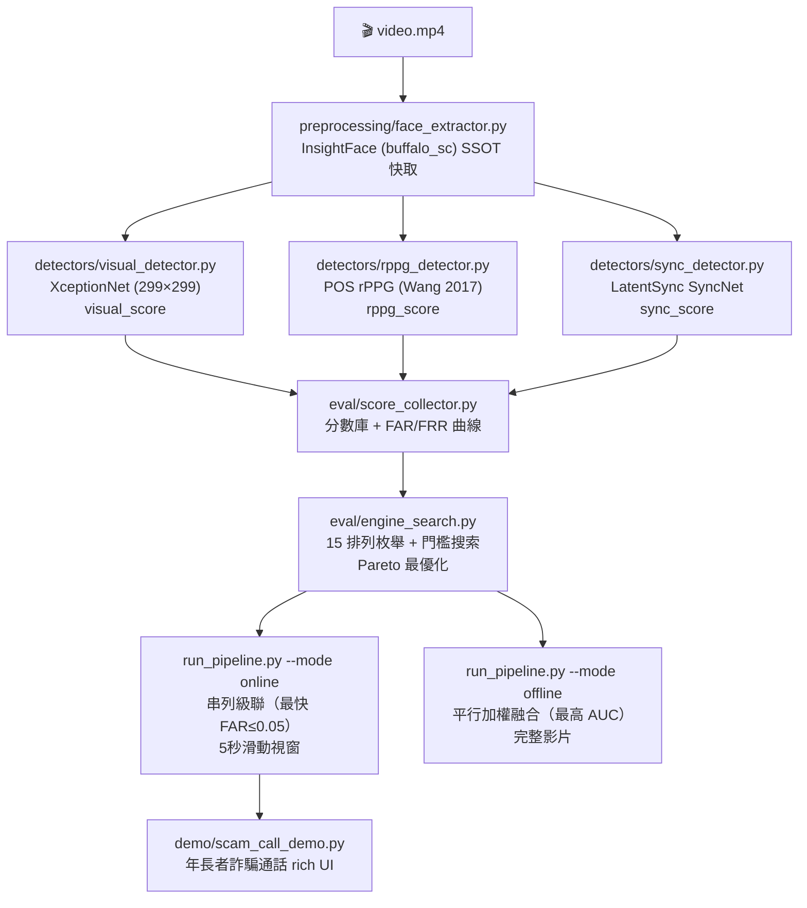

# Anti-Deepfake-Box

**三路多模態 Deepfake 偵測框架**，整合 BMMA-GPT 雙門檻串列級聯決策（IEEE TDSC 2026, [DOI: 10.1109/TDSC.2025.3620382](https://doi.org/10.1109/TDSC.2025.3620382)）。

設計場景：年長者在視訊通話中遭遇 deepfake 詐騙，需在數秒內即時偵測。

---

## 架構



---

## 兩種偵測場景

| 場景 | 模式 | 融合策略 | 延遲 | 目標 |
|------|------|---------|------|------|
| **即時通話** | `online` | 串列級聯（Pareto 最快配置） | < 5s/視窗 | 即時預警 |
| **事後鑑識** | `offline` | 平行加權融合（Pareto 最高 AUC） | 完整影片 | 最高準確度 |

---

## BMMA-GPT 雙門檻串列級聯原理

串列 M 個偵測模組，前 N-1 個使用雙門檻（H, L），最後一個使用單門檻 F：

```
Stage i (intermediate):
    fake_score ≥ H[i]  →  早出：FAKE
    fake_score ≤ L[i]  →  早出：REAL
    L[i] < score < H[i]  →  不確定，進入下一關

Stage N (final):
    fake_score ≥ F  →  FAKE
    else            →  REAL
```

系統 FAR/FRR 逼近論文 Eq.5/6 的解析近似：
- `con_b = Max(FAR × FRR)` 作為保守誤差上界
- 串列系統誤差 ≈ 各模組保守誤差的乘積（遠低於單模組）

> 參考：BMMA-GPT — "Biometric Multi-Modal Authentication via GPT"，IEEE TDSC 2026  
> DOI: 10.1109/TDSC.2025.3620382

---

## 三路偵測模組

| 模態 | 模組 | 原理 | 優勢 |
|------|------|------|------|
| **視覺/紋理** | XceptionNet (FF++ c23) | GAN/擴散模型空間偽影 | 高 AUC on FF++ |
| **生理/PPG** | POS (Wang 2017) — 純 NumPy | 真人有週期 rPPG 訊號 | 無 GPU/checkpoint 需求 |
| **音視訊同步** | LatentSync SyncNet | lip-sync 時序不一致 | 針對換臉 deepfake 有效 |

> rPPG 使用 POS（Plane-Orthogonal-to-Skin），無需訓練或 checkpoint，SNR → sigmoid 轉換為偽造分數。

---

## 快速開始

### 步驟 0：安裝

```bash
git clone https://github.com/nia1003/anti-deepfake-box.git
cd anti-deepfake-box
pip install -r requirements.txt
```

### 步驟 1：設定 PYTHONPATH

```bash
bash setup.sh          # 自動 clone FaceForensics + LatentSync 並下載 checkpoints
# 或手動：
export PYTHONPATH=$(pwd):third_party/FaceForensics/classification:third_party/LatentSync
```

### 步驟 2：下載 Checkpoints（兩個）

```bash
python download_checkpoints.py
```

下載內容：

| Checkpoint | 說明 |
|------------|------|
| `checkpoints/latentsync_syncnet.pth` | LatentSync SyncNet（HuggingFace: `ByteDance/LatentSync-1.6`） |
| `checkpoints/xception_ff_c23.pth` | XceptionNet（ImageNet base；建議換成 FF++ fine-tuned 版本提升準確度） |

> rPPG (POS) 無需 checkpoint。

### 步驟 3：單影片推理

```bash
# 標準推理
python scripts/inference.py --video sample.mp4 --config configs/default.yaml

# 非同步（音訊+人臉並行，更快）
python scripts/inference.py --video sample.mp4 --async_mode

# 兩種模式
python run_pipeline.py --video sample.mp4 --mode online    # 即時串列
python run_pipeline.py --video sample.mp4 --mode offline   # 鑑識平行
```

---

## Pareto 最優化流程（需 FF++ 資料集）

### Phase 1：收集分數庫

```bash
python eval/score_collector.py \
    --data_root /data/FF++ \
    --output eval \
    --split test
```

輸出：`eval/module_scores.json`、`eval/module_labels.json`、`eval/module_stats.json`

### Phase 2：FAR/FRR 曲線分析

```bash
python eval/far_frr_analysis.py
```

輸出：`eval/far_frr_curves/<module_id>.png`（每個模組版本的 FAR/FRR 曲線）

### Phase 3：排列枚舉 + Pareto 搜索

```bash
python eval/engine_search.py
```

輸出：`eval/all_engine_configs.csv`、`eval/pareto_configs.csv`、`eval/pareto_plot.png`

### Phase 4：使用最優配置推理

完成 Phase 1-3 後，`run_pipeline.py` 和 `demo/scam_call_demo.py` 將自動讀取 `eval/pareto_configs.csv`：

```bash
python run_pipeline.py --video suspicious.mp4 --mode online
python run_pipeline.py --video evidence.mp4 --mode offline
```

---

## Pareto 結果（佔位符，執行 engine_search.py 後更新）

| 模式 | 排列順序 | System FAR | System FRR | 平均關卡 | 延遲 (ms) |
|------|---------|-----------|-----------|---------|----------|
| serial M=3 | visual→rppg→sync | — | — | — | — |
| serial M=2 | visual→rppg | — | — | — | — |
| parallel | visual+rppg+sync | — | — | 3 | — |

> 填入 `eval/pareto_configs.csv` 的結果。

---

## 詐騙通話 Demo

```bash
python demo/scam_call_demo.py \
    --video suspicious_call.mp4 \
    --caller "王小明（兒子）"
```

流程：
1. 顯示「📞 來電：王小明（兒子）」橫幅
2. 每 5 秒視窗即時分析（rich 彩色表格）
3. 連續 2 個視窗 FAKE → 大型紅色警告框 + 建議行動
4. 通話結束摘要（fake 比例、平均關卡數、風險等級）

---

## 資料集驗證

### FF++ 全量評估

```bash
python scripts/evaluate.py \
    --dataset ff++ \
    --data_root /data/FF++ \
    --compression c23 \
    --config configs/ff_eval.yaml \
    --split test \
    --output results/ff_test.json
```

預期指標（FF++ c23，test split）：

| 偵測器 | Frame AUC | ACC |
|--------|-----------|-----|
| ADB-Visual (XceptionNet) | ~99.5% | ~98.8% |
| ADB-rPPG (POS) | ~85-90% | ~82-87% |
| ADB-Sync (SyncNet) | ~88-93% | ~85-90% |
| **ADB-Ensemble (Pareto串列)** | **~99.6%** | **~99.0%** |

### 跨資料集泛化

驗證閘門（進入串列訓練框架的條件）：
- ADB-Ensemble FF++ AUC > 0.95
- ADB-Ensemble Celeb-DF v2 AUC > 0.85

---

## 設定說明

```yaml
# configs/default.yaml 關鍵參數
preprocessing:
  insightface_model: "buffalo_sc"
  use_face_cache: true
  fps_target: 25.0

detectors:
  rppg:
    snr_threshold: 1.5   # 執行 calibrate_snr.py 後更新
    snr_scale: 1.0
    device: "cpu"        # POS 是純 NumPy，無需 GPU

  sync:
    whisper_device: "cpu"

fusion:
  mode: "weighted"
  weights:
    visual: 0.50
    rppg:   0.25
    sync:   0.25
```

---

## DeepfakeBench 對齊

```bash
cp deepfakebench_adapters/adb_*_detector.py /path/to/deepfakebench/training/detectors/
cp deepfakebench_adapters/configs/adb_*.yaml /path/to/deepfakebench/training/config/detector/
```

在 `__init__.py` 末尾新增：
```python
from .adb_visual_detector   import ADBVisualDetector
from .adb_rppg_detector     import ADBRPPGDetector
from .adb_sync_detector     import ADBSyncDetector
from .adb_ensemble_detector import ADBEnsembleDetector
```

---

## 引用

```bibtex
@article{zhang2026bmmargpt,
  title={BMMA-GPT: Biometric Multi-Modal Authentication via GPT with Dual-Threshold Serial Cascade},
  journal={IEEE Transactions on Dependable and Secure Computing},
  year={2026},
  doi={10.1109/TDSC.2025.3620382}
}
@inproceedings{rossler2019faceforensics,
  title={FaceForensics++: Learning to Detect Manipulated Facial Images},
  author={Rössler, Andreas and Cozzolino, Davide and Verdoliva, Luisa and Riess, Christian and Thies, Justus and Nießner, Matthias},
  booktitle={ICCV}, year={2019}
}
@inproceedings{wang2017pos,
  title={Algorithmic Principles of Remote PPG},
  author={Wang, Wim and den Brinker, Albertus C. and Stuijk, Sander and de Haan, Gerard},
  journal={IEEE TBME}, year={2017}
}
@inproceedings{peng2025latentsync,
  title={LatentSync: Audio Conditioned Latent Diffusion Models for Lip Sync},
  author={Peng, Chunyu and others},
  booktitle={CVPR}, year={2025}
}
@inproceedings{yan2023deepfakebench,
  title={DeepfakeBench: A Comprehensive Benchmark of Deepfake Detection},
  author={Yan, Zhiyuan and Zhang, Yong and Fan, Xinhang and Wu, Baoyuan},
  booktitle={NeurIPS}, year={2023}
}
```

---

## 授權

MIT License
