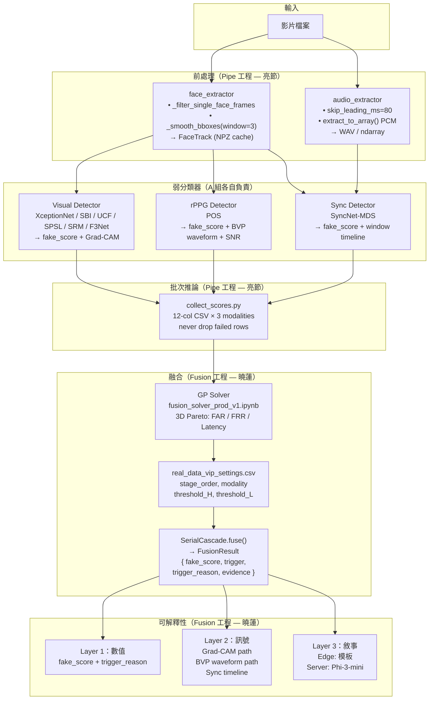

# Week 13 報告計畫

**目標**：向老師介紹預計的提案，說明每個模組流程。

---

## 一、報告大綱

```
§1  專案定位與情境
§2  系統整體架構（Sandbox 三模態 + Cascade）
§3  可解釋性設計（五層輸出）
§4  弱分類器現況與新增欄位
§5  Pareto Point 設計（FAR / FRR / Latency）
§6  音訊前處理（DeepfakeBench-MM 方法）
§7  下一步
```

---

## 二、系統整體架構

```
輸入影片
  ├─ face_extractor  → FaceTrack (aligned_256 + bboxes + landmarks)
  │    ├─ _filter_single_face_frames()   單臉篩選
  │    └─ _smooth_bboxes(window=3)       時序平滑
  │
  ├─ audio_extractor → WAV / PCM array  (skip_leading_ms=80)
  │
  ├─ [Visual]   XceptionNet  → fake_score + Grad-CAM heatmap
  ├─ [rPPG]     POS          → fake_score + BVP waveform + SNR
  └─ [AV Sync]  SyncNet-MDS  → fake_score + window sync timeline
        ↓
  SerialCascade（GP solver 輸出的雙門檻 CSV）
        ↓
  FusionResult { fake_score, trigger, trigger_reason, evidence }
        ↓
  ExplainNarrator → Layer 1 / Layer 2 / Layer 3 輸出
```

---

## 三、可解釋性設計（五層）

| 來源 | 輸出 | 範例 |
|---|---|---|
| 視覺 (Xception) | Grad-CAM heatmap | 「眼角和下巴邊界有混合偽影」 |
| rPPG (POS) | BVP 波形 + SNR | 「SNR=0.42dB < 門檻 1.5dB，心率訊號異常」 |
| Sync (SyncNet) | Window timeline | 「1.0–2.0s 嘴部同步信心掉至 0.21」 |
| Cascade | 觸發 stage + 路徑 | 「Stage 1 visual score=0.83 ≥ H=0.75，FAKE 早退出」 |
| LLM | 統一敘事 | 用戶可讀的完整說明（template edge / Phi-3-mini server） |

### Layer 定義

- **Layer 1（數值）**：`fake_score`, `trigger`, `trigger_reason` — 無需 GPU，edge 永遠可輸出
- **Layer 2（訊號）**：Grad-CAM 熱圖 path, BVP 波形 path, sync timeline list — Stage 退出時附帶
- **Layer 3（敘事）**：`narrative` 字串 — edge 用模板，server 用 LLM

### 可解釋性的時間成本觀察

| 項目 | 增加延遲 | 說明 |
|---|---|---|
| Grad-CAM（hook-based） | +5–15ms | backward pass，不需額外模型 |
| BVP waveform 儲存 | ~0ms | rPPG 已計算，僅多回傳 |
| Sync timeline | ~0ms | sliding window score list 已有 |
| 模板敘事 | <1ms | 字串格式化 |
| LLM 敘事（Phi-3-mini） | ~500ms | server only，edge 不跑 |

---

## 四、弱分類器（Weak Classifiers）現況

### 已產出的 Score CSV（`E:\114_IMProject\data\outputs`）

| 負責人 | 偵測器 | 資料集 | 檔案 |
|---|---|---|---|
| 靖雯 | SBI | FF++, CelebDF, DFDC | `scores_visual_sbi_ffpp_v0.csv` 等 |
| 靖雯 | SPSL | FF++, CelebDF（calibrated） | `scores_visual_spsl_*` |
| 靖雯 | SRM | FF++, CelebDF | `scores_visual_srm_*` |
| 靖雯 | F3Net | FF++, CelebDF | `scores_visual_f3net_*` |
| 靖雯 | Threshold sweep | F3Net / SBI / SPSL / SRM | `threshold_sweep_*_v0/v1.csv` |
| 禹丞 | Xception-ft | FF++, CelebDF, DFDC | `scores_visual_xception_ft_*` |
| 禹丞 | UCF | FF++, CelebDF, DFDC | `scores_visual_ucf_*` |
| 禹丞 | Threshold sweep | Xception-ft, UCF | `threshold_sweep_*_v0` |
| 劭瑋 | SyncNet-MDS | DFDC, DF-TIMIT, FakeAVCeleb | `scores_avsync_syncnet_*_v0.csv` |
| 劭瑋 | Threshold sweep | SyncNet | `threshold_sweep_syncnet_v0.csv` |

### 現有 CSV 欄位（v0 格式）

```
sample_id, fake_score, label, inference_ms
```

### 新增欄位（v5 格式，對齊 GP solver 12-col 合約）

```
sample_id, dataset, label,
detector_name, modality, fake_score, score_type,
inference_time_ms, window_start_sec, window_end_sec,
status, error_message
```

**關鍵規則**：`status="failed"` 的列不得刪除（GP `data_validator_v1` 用 NaN fallback 對齊 sample_id）

---

## 五、Pareto Point 設計

**三個目標，越小越好**：

| 目標 | 說明 | 來源 |
|---|---|---|
| **FAR（彈性）** | False Accept Rate，偽造漏放率 | GP solver threshold_L |
| **FRR（安全）** | False Reject Rate，真實誤拒率 | GP solver threshold_H |
| **Latency（延遲）** | 從輸入到 FusionResult 的總時間 ms | Cascade 早退出節省後段 |

### Cascade 早退出的 Latency 效益

```
Stage 1 觸發（rPPG, ~3ms）   → 不跑 Stage 2/3（省 ~220ms）
Stage 2 觸發（Sync, ~45ms）   → 不跑 Stage 3（省 ~180ms）
Stage 3 觸發（Visual, ~225ms）→ 完整跑完
全不確定（0.5）               → 最壞情況 ~225ms + 可選 LLM 500ms
```

### 3D Pareto 前緣分析圖

> 圖示：x 軸 FRR（安全）、y 軸 FAR（彈性）、z 軸 延遲 ms。
> **紅點** = Pareto 前緣解（無法同時在三個維度都更小的點）；灰點 = 被支配解。
> 前緣從左下角（低 FAR / 低 FRR / 高延遲）到右上角（高 FAR / 高 FRR / 低延遲），
> 展示安全-彈性-速度的三角取捨。左前方紅點（延遲 ~50ms、FAR ~0.1）代表
> rPPG-first Cascade 的 early-exit 配置，是 edge 部署的目標區域。

### GP solver 3D Pareto（計畫）

原 GP solver 最佳化 FAR + FRR（2D），加入 `inference_time_ms` budget 後：

```python
# collect_scores.py 現有欄位
"inference_time_ms": round((time.time() - t0) * 1000, 1)

# fusion_solver_prod_v1.ipynb 新增 constraint
# latency_budget_ms = 100  # 例：≤100ms
# 使 Cascade 優先選延遲低的 stage 排序
```

---

## 六、音訊前處理（DeepfakeBench-MM 方法）

| 論文方法 | 對應實作 | 位置 |
|---|---|---|
| 前導靜音移除 80ms（§B.1） | `AudioExtractor(skip_leading_ms=80)` | `preprocessing/audio_extractor.py` |
| NPZ 格式預解碼音訊（§3.1） | `_save_cache()` 嵌入 `audio_samples` + `frame_to_audio_offset` | `preprocessing/face_extractor.py` |
| 單臉幀篩選（§3.2） | `_filter_single_face_frames(min_frames=8)` | `preprocessing/face_extractor.py` |
| 時序平滑 window=3（§3.2） | `_smooth_bboxes(window=3)` causal MA | `preprocessing/face_extractor.py` |

**對齊常數**：
```
16000 Hz / 25 fps = 640 samples/frame
STFT hop = 160 samples（10ms）→ 4 STFT frames/video frame
```

---

## 七、偵測器候選表（摘要）

### Visual 模態

| 偵測器 | 年份 / 會議 | Within AUC (FF++c23) | Cross AUC (CelebDFv2) | Edge | 實作狀態 |
|---|---|---|---|---|---|
| **SBI** | CVPR 2022 Oral | 0.9964 | **0.9318** | 中 | inference passed ✓ |
| **Xception** | CVPR 2017 | 0.9970 | 0.6530 | Yes | repo found ✓ (已跑通) |
| **UCF** | — | 0.9895 | 0.7430 | 中 | repo found ✓ |
| SPSL | CVPR 2021 | 0.9610 | 0.7650 | 中 | repo found (DFB) |
| F3Net | ECCV 2020 | 0.9635 | 0.7352 | 中 | repo found |
| SRM/HFF | CVPR 2021 | 0.9576 | 0.7552 | 中 | repo found |
| LSDA | CVPR 2024 | N/A | 0.8300 | 低-中 | repo found (DFB) |
| Face X-Ray | CVPR 2020 | — | 0.7950 | 可能有困難 | repo found |

### AV Sync 模態

| 偵測器 | 年份 / 會議 | 效能 | Edge | 實作狀態 |
|---|---|---|---|---|
| **SyncNet-MDS** | ACM MM 2020 | DFDC 84.4%, DF-TIMIT 96.6% | 高 | repo found ✓ (劭瑋已產出 CSV) |
| MRDF | ICASSP 2024 | FakeAVCeleb AUC 92.43% | 低 | repo found (CUDA 11.6 限制) |
| LatentSync | arXiv 2024 | N/A（生成器） | 低 | 不適用 |

### rPPG 模態

| 偵測器 | 年份 / 來源 | Edge | 實作狀態 |
|---|---|---|---|
| **POS** | IEEE TBME 2017 | **Yes（0MB, ~3ms, no GPU）** | repo found ✓ |
| TS-CAN / MTTS-CAN | NeurIPS 2020 | Yes（150+ FPS on ARM） | repo found（待建環境）|
| PhysMamba | CCBR 2024 | Maybe | repo found（環境風險高） |

---

## 八、文獻對照（Paper Registry 摘要）

| ID | Short Name | 年份 | 與本專案關係 |
|---|---|---|---|
| P01 | DeepfakeBench | 2023 | Score CSV 格式 + 統一評估協定 |
| P02 | Xception | 2017 | Tier 1 baseline backbone |
| P03 | FaceForensics++ | 2019 | FF++ c23/c40 資料集依據 |
| P04 | Face X-Ray | 2020 | 可解釋偽影（blending boundary）|
| P05 | F3Net | 2020 | 頻域偽影文獻 |
| P06 | SPSL | 2021 | 相位頻譜可解釋性 |
| P07 | HFF/SRM | 2021 | 高頻噪聲偽影 |
| P08 | SBI | 2022 | 泛化性最佳 visual detector |
| P09 | LSDA | 2024 | 最新 SOTA 泛化方法 |
| P10 | BMMA-GPT | 2026 | 雙門檻多模態決策 → GP solver 依據 |
| P11 | POS / rPPG | 2017 | rPPG 生理訊號理論基礎 |
| P12 | MTTS-CAN | 2020 | rPPG on-device 參考 |
| P13 | PhysMamba | 2024 | rPPG 深度序列模型（進階） |
| P14 | AV Dissonance | 2020 | SyncNet-MDS 核心文獻 |
| P15 | MRDF / CWM | 2024 | 多模態正則化 av_sync |
| P16 | LatentSync | 2024 | lip-sync 生成器（攻擊能力參考） |
| P17 | SyncNet | 2016 | SyncNet 原始論文 |
| XAI01 | DF-P2E | 2025 | 可解釋性架構參考（Grad-CAM + LLM）|

---

## 九、ADB 執行流程（Mermaid）



---

## 十、流程各節點使用資料集

| 節點 | 資料集 | 用途 | 有無音訊 |
|---|---|---|---|
| **Visual 弱分類器訓練** | FF++ c23（1000r + 4000f） | within-domain 訓練基準 | 無 |
| **Visual 弱分類器評估** | FF++ c23（within） | 偵測率基準 AUC | 無 |
| | CelebDF v2（cross） | 跨域泛化 AUC | 無 |
| | DFDC（cross） | 額外跨域驗證 | 有（部分）|
| **rPPG sanity check** | PURE / UBFC | SNR 基準（真人生理訊號） | 無 |
| **rPPG deepfake 評估** | FF++ c23 small sample | real/fake SNR 差異 | 無 |
| | FakeAVCeleb v1.2 | 有音訊的多模態偽造 | 有 |
| **SyncNet 評估** | DFDC | within-domain AUC 84.4% | 有 |
| | DF-TIMIT | within-domain AUC 96.6% | 有 |
| | FakeAVCeleb v1.2 | 多類別 av_sync 評估 | 有 |
| **GP Solver 輸入** | 三組 12-col CSV | sample_id 對齊，計算 Pareto | — |
| **Threshold sweep** | FF++ c23 / CelebDF v2 | FAR-FRR 曲線，EER 計算 | — |
| **壓縮降解測試（未來）** | FF++ c23→c40 重壓縮 | CRF=23/28/34/40/51 AUC 曲線 | — |

---

## 十一、Week 14 任務分配

### A 組：繼續各自負責的弱分類器

| 負責人 | 任務 | 資料集 |
|---|---|---|
| **靖雯** | SBI / SPSL / SRM / F3Net — 升級至 12-col CSV，補 status/error_message | FF++ + CelebDF |
| **禹丞** | Xception-ft / UCF — 升級至 12-col CSV；Xception 加 Grad-CAM hook | FF++ + CelebDF |
| **劭瑋** | SyncNet-MDS — 升級至 12-col CSV；補 window_start_sec / window_end_sec | DFDC + FakeAVCeleb |

### 亮節：Pipe 工程

| 優先 | 任務 | 關鍵檔案 |
|---|---|---|
| P1 | `collect_scores.py` — 12-col，try-except，never drop failed rows | `scripts/collect_scores.py`（新建）|
| P1 | `audio_extractor.extract_to_array()` — PCM ndarray，no temp file | `preprocessing/audio_extractor.py` |
| P2 | `face_extractor._filter_single_face_frames()` + `_smooth_bboxes()` | `preprocessing/face_extractor.py` |
| P2 | `_save_cache()` 嵌入 audio_samples + frame_to_audio_offset（NPZ） | `preprocessing/face_extractor.py` |
| P3 | DeepfakeBench `abstract_dataset.py` 5 項修改（video_name / npz_path / audio） | `DeepfakeBench/training/dataset/` |

### 曉蓮：Fusion 工程

| 優先 | 任務 | 關鍵檔案 |
|---|---|---|
| P1 | `FusionResult` 加 `trigger` / `trigger_reason` / `evidence` 欄位 | `fusion/weighted_ensemble.py` |
| P1 | `SerialCascade.fuse()` 回傳 `exit_stage`（local 變數已存在，缺寫入） | `fusion/serial_cascade.py` |
| P1 | rPPG `_detect_impl()` 回傳 BVP waveform（`get_ppg_and_snr()` 已有） | `detectors/rppg_detector.py` |
| P2 | `cascade_selection.py` — 4 階段弱分類器選擇（AUC / 相關係數 / Pareto） | `fusion/cascade_selection.py`（新建）|
| P2 | `ExplainNarrator` 模板模式（Layer 1–3 輸出） | `detectors/explain_narrator.py`（新建）|
| P3 | GP solver 加入 latency budget constraint（3D Pareto 第三軸） | `fusion_solver_prod_v1.ipynb` |
